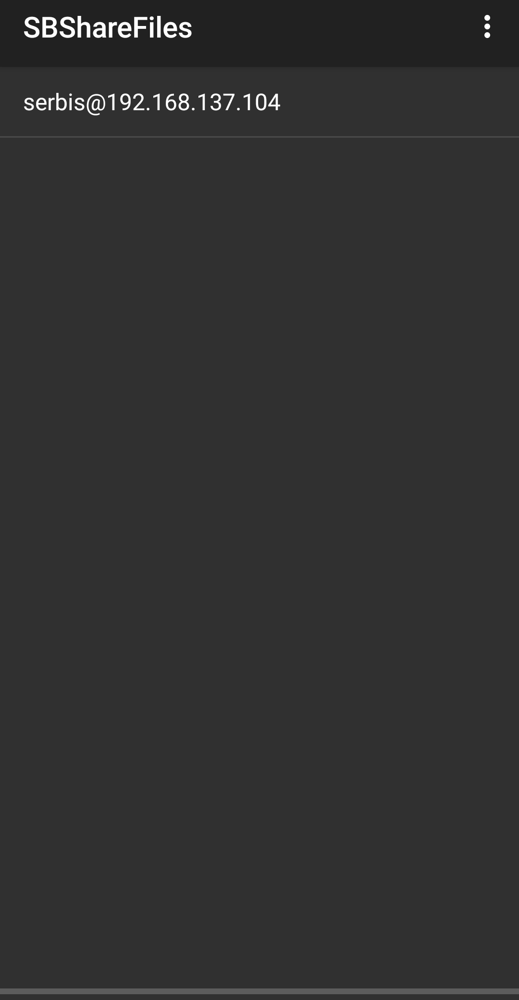
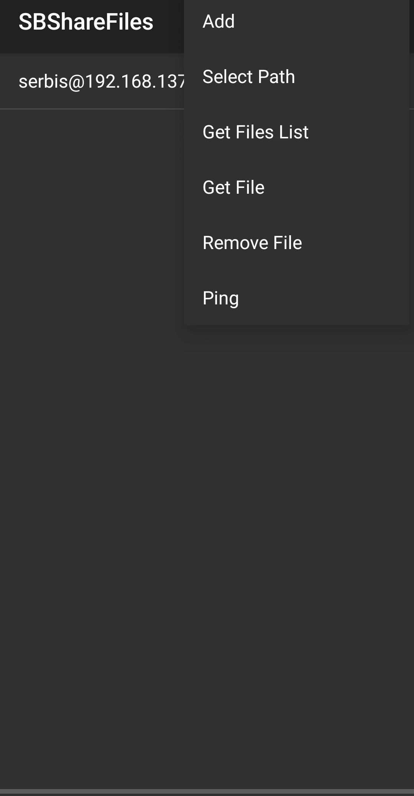
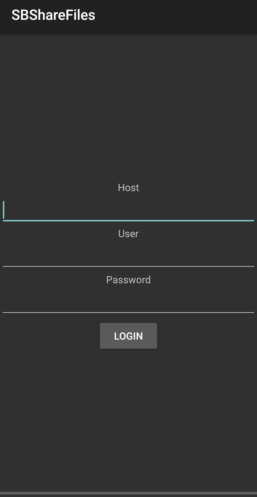
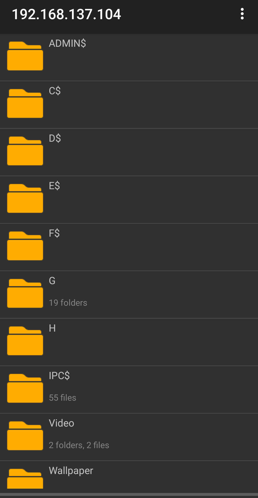

SBShareFiles

The tool provides access to the windows shared folders

- Main activity

  

  You can click on existing account for browsing shared files or click sandwich button on the right-top corner and select in the main menu point Add for creating a new account

  

  

  You should add ip address of your windows computer in your local network and user credentials

  